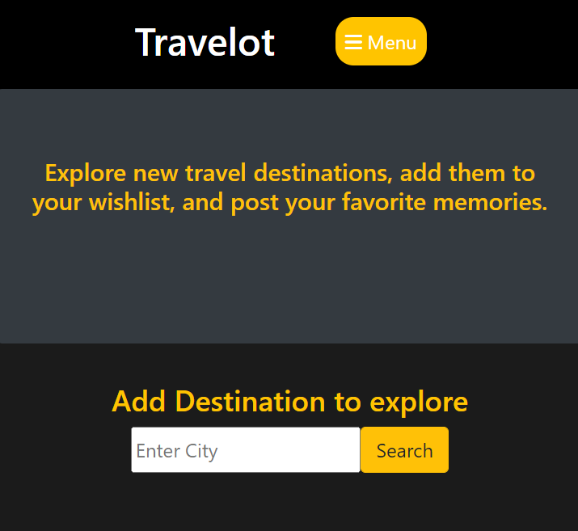

 # Travellot

  

## Table-of-Contents

  * [Description](#description)
  * [Installation](#installation)
  * [Usage](#usage)
  * [License](#license)
  * [Tests](#tests)
  * [Contributers](#contributers)
  

  ## [Description:](#table-of-contents)

  #### This application makes travel planning easier and also lets you cherish past traveling memories. Plan your trip, add to your wishlist, and save your memories.

  ## [Installation](#table-of-contents)

  #### node, sequelize

  ## [Usage](#table-of-contents)

  #### Create login, save to wishlist and trips pages.

  

  
  ## License
    
  The application is covered under the following license:
    
  
  
    

  ## [Tests](#table-of-contents)

  #### vscode, heroku, github

  ## [Contributers](#table-of-contents)

  * Angela Gola
  * Kyle Bort
  * Daniel Warren
  * Giovanni Claro 
  #### &copy;2022 All Rights Reserved.
